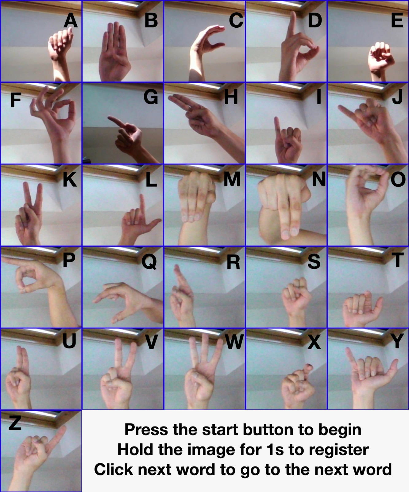

# SST Coursework 2022

## About the app

A python application that utilises the tensorflow object detection algorithm to achieve automatic detection of american sign language gestures.

This app was created to allow for the more seamless integration of **American Sign Language(ASL)** into our daily lives through the use of a **machine learning model** in order to construct a realtime ASL translator in python. The translator features autocorrect features, as well as an intuitive gui to help with the usage of the app.

The app utilises a machine learning model that was trained through **transfer learning** with pre-trained object detection models from the Tensorflow model zoo. The Tensorflow object detection library is utilised to allow for the real time detection of hand gestures from the webcam. Jupyter notebooks used for dataset collection and model training can be found under the Training programs folder in Tensorflow/workspace. A list of dependencies used in this project can be found in the requirements.txt file. All reference material used during the creation of this projects can be found in the credits section below. The dataset used for the training of the machine learning model can be found **[here](https://www.kaggle.com/grassknoted/asl-alphabet)**.

Disclaimer: This is a **prototype** machine learning app built on a **limited** dataset with **limited** computational power, we are unable to guarantee 100% accuracy in the detection of hand gestures

## Installation Steps

<b>Step 1.</b> Clone this [repository](https://github.com/Xavier3372/coursework-final)

<b>Step 2.</b> Open a new terminal window and cd into the program directory
<pre>
# In a new terminal window
cd {your program directory here}
</pre>

<b>Step 3.</b> Create a virtual environment
<pre>
pip install virtualenv
virtualenv venv 
</pre>

<b>Step 4.</b> Activate the virtual environment
<pre>
source venv/bin/activate # Mac
.\venv\Scripts\activate # Windows 
</pre>

<b>Step 5.</b> Install dependencies
<pre>
pip install numpy six cython
pip install -r requirements.txt 
</pre>

<b>Step 6.</b> Run the app
<pre>
python3 app.py
</pre>

## Using the program
### Buttons
**Next word:** Use this button to move on to the next word in the sentence

**Backspace:**  Use this button to remove the last letter that you entered into a word

**Reset:** Use this button to reset the sentence and start a new sentence

**Enable Autocorrect:** Use this button to toggle the autocorrect function of the program

### Detection
In order for a letter to be detected and appended into the word, the hand gesture corresponding to the letter would have to be held inside the recognition box for 1 second.

This program recognises a modified version of conventional ASL that has a greater variation between the shapes of hand gestures to allow for more accurate differentiation of ASL gestures. A guide to this modified version of ASL can be found below. 

For the greatest accuracy in the detection of ASL gestures, it is recomended that the hand gesture is done with a light coloured background. Detection of characters works best when the hand being used for the gesture is placed like in the sample images above.

## Credits
### Contributers

 Below is a list of contributers who helped with the creation of this project 

**[Jovan Ang](https://github.com/DudeNav0J)**

**[Jerald Tee](https://github.com/jeraldtea)**

**[Xavier Koh](https://github.com/Xavier3372)**

### References

 Below is a list of websites, videos and repositories referenced and used in the creation of this project 

**Special Thanks to [Kaggle](https://www.kaggle.com/grassknoted/asl-alphabet) for providing us with an extensive dataset on which to train the machine learning model.**

**Special Thanks to [Alexander Chow](https://medium.com/nerd-for-tech/coding-an-ai-to-recognize-sign-language-with-tensorflow-and-keras-6cf8180c5f45) for providing us with a tutorial on which to base our training code**

